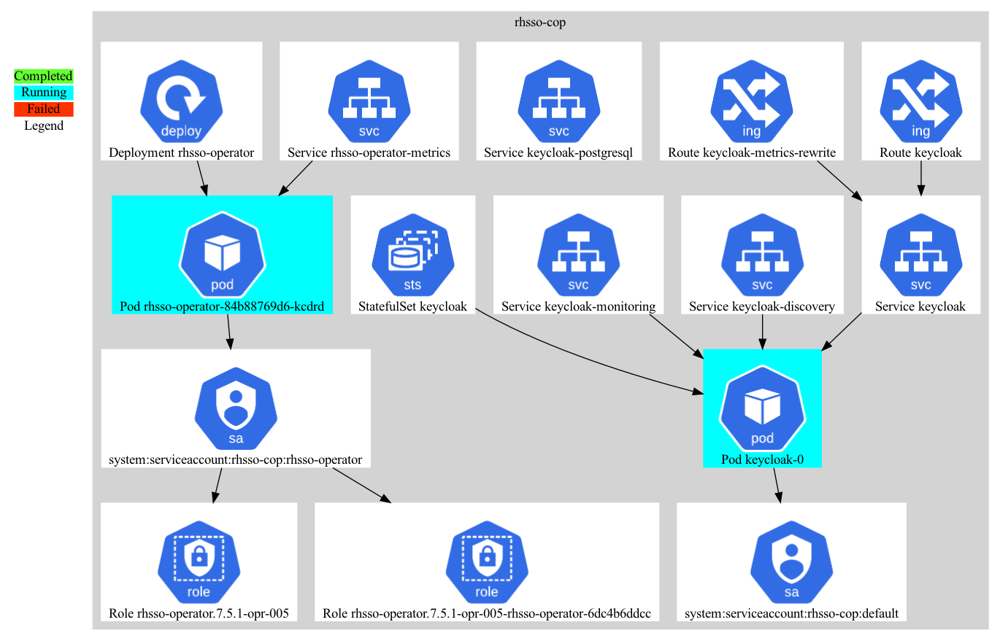

# openshift-topology-exporter
Simple tool to export the topology configuration and visualize it in GraphViz.

Resources exported and connectedin the diagrams are:
* Namespace
* Route
* Service
* Deployment
* DeploymentConfig
* Pod
* ServiceAccount
* RoleBinding

This tool is based on the [OpenShift Client in Go](https://github.com/openshift/client-go) and requires [Golang](https://go.dev/).

## Instructions
Configure the target namespaces in [config.yaml](./config.yaml), then run as:
```shell
go run exporter.go
```

Install [Graphviz](https://graphviz.org/) and visualize it as:
```shell
dot -Tpng diagram.dot > diagram.png
```

The resulting diagram is in the generated `diagram.png` image file.

An example diagram is given, captured from a real deployment of the [Red Hat Single Sign-On](https://access.redhat.com/products/red-hat-single-sign-on):

